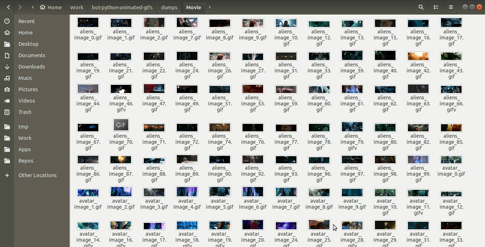

# Google Images Scraper

> A bot that downloads all the available non-textual images from google a particular [keyword](https://www.google.com/search?as_st=y&tbm=isch&hl=en&as_q=attack+on+titan+&as_epq=anime&as_oq=&as_eq=meme&cr=&as_sitesearch=&safe=images&tbs=itp:animated,iar:xw,ift:gif) with required filters.



# Install

You will require `python3` and `pip3` installed to use the script.

```bash
# clone repository
git clone https://github.com/skdcodes/freelancer-bot-python_selenium_vision-Google_Images_Scraper.git google-images-scraper
# change working directory
cd google-images-scraper
# install python modules
pip3 install -r requirements.txt
```

# Usage

You will need to create a Google Vision API key as shown in this [tutorial](https://cloud.google.com/vision/docs/setup). Download the API `.json` file so obtained and save it in the project folder as `google_api_key.json`

Modify the default `keywords.txt` to include the searches that you wish to scrape. One search should be written in one line. Each search must be of the format `keyword, category` eg. `avengers, movie`

Finally, start the scrapping by running:

```bash
python3 scrape.py
```

You will see a progress on your terminal. The thumbnails are saved to `tmp/category/keyword` and the original images that do not contain any text are saved to `dumps/category/keyword`

# Dependencies

The following python dependencies are used:

1. `selenium` - For opening a headless browser session to collect the images.
2. `webdriver_manager` - For automatically installing and managing selenium headless browsers.
3. `bs4` - For parsing HTML schema.
4. `google` - For using Google Vision API servies.
5. `coloredlogs` - For displaying styled logging to terminal.

# Features

1. Search for multiple one after the other by mentioning each keyword one per line in `keywords.txt`
2. Uses [Google Vision API](https://cloud.google.com/vision/docs/ocr#vision_text_detection-python) to detect text from a image thumbnail. Then proceeds to only download original images if image thumbnail does not have any text.
3. Allows infinite scrolling to fetch all the available images. This bypasses the max limit of `100` images per page. This option is **not enabled** by default. To enable this feature, open `scrape.py` and change the lines:

   ```python
   # scrape.py

   scroll = True
   ```

4. Ability to add custom filters by changing the base url: [https://www.google.com/search?as_st=y&tbm=isch&hl=en&as_q=&as_epq=simpsons&as_oq=&as_eq=meme&cr=&as_sitesearch=&safe=images&tbs=itp:animated,iar:xw](https://www.google.com/search?as_st=y&tbm=isch&hl=en&as_q=&as_epq=simpsons&as_oq=&as_eq=meme&cr=&as_sitesearch=&safe=images&tbs=itp:animated,iar:xw)

# Notes

- Google provides only `100` images by default on page load. In order to download all images, refer to the third point mentioned in [Features](#features).
- It is useful to follow this [tutorial](https://cloud.google.com/vision/docs/setup) in order to obtain the JSON key for using Google Vision API.
